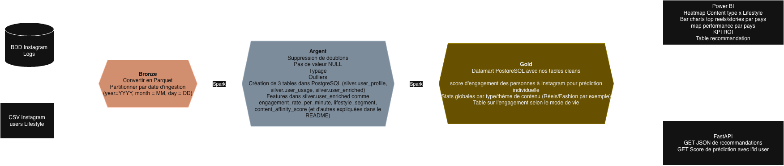

# Projet_Big_Data_Instagram

# Instagram Engagement Optimizer - Big Data Project

## 1. Problematique Metier

Dans un contexte de saturation des reseaux sociaux, l'optimisation de la retention repose sur la precision du ciblage de contenu. Ce projet repond a la problematique suivante :

**« Quel type de contenu (Reels, Stories, Posts, themes) maximise l’engagement pour chaque segment d’utilisateurs ? »**

L'objectif est de transformer des donnees comportementales et lifestyle en insights decisionnels via une segmentation client (Clustering) et une prediction du score d'engagement.

## 2. Architecture des Donnees (Medallion Architecture)

Le pipeline repose sur une architecture de donnees distribuee utilisant Apache Spark et le framework Delta Lake pour garantir l'integrite et la tracabilite des donnees.

### Couche Bronze (Raw Data)

* **Sources :** Ingestion des logs d'utilisation (comportemental) et des fichiers CSV (profils utilisateurs).
* **Format :** Conversion en Parquet.
* **Optimisation :** Mise en place d'un partitionnement initial pour accelerer les traitements Spark.

### Couche Silver (Curated Data)

* **Nettoyage :** Suppression des doublons et gestion des valeurs manquantes (NULL).
* **Normalisation :** Typage des colonnes (age, temps d'utilisation, scores) et traitement des valeurs aberrantes (outliers).
* **Feature Engineering :** Calcul de variables derivees (ex: ratio likes/sessions, temps moyen par type de contenu).

#### **Table 1 : `silver.users_profiles`** (Données statiques)
Profils utilisateurs nettoyés issus du CSV Instagram Users Lifestyle.

| Colonnes clés | Description |
|---------------|-------------|
| `user_id` (PK) | Identifiant unique utilisateur |
| `age`, `gender`, `country` | Démographie |
| `content_type_preference` | Reels/Stories/Photos |
| `preferred_content_theme` | Fitness/Fashion/Food/Travel/Tech/Family |
| `perceived_stress_score` | Score stress 0-10 |
| `weekly_work_hours` | Heures travail/semaine |
| `exercise_hours_per_week` | Heures sport/semaine |
| `ingestion_date` | Date ingestion (partition) |

**Partitionnement** : `year/month/day/country/`

#### **Table 2 : `silver.users_usage`** (Données dynamiques)
Logs d'utilisation app nettoyés issus de la BDD.

| Colonnes clés | Description |
|---------------|-------------|
| `user_id` (PK) | Clé jointure |
| `daily_active_minutes_instagram` | Temps actif/jour |
| `user_engagement_score` | Score 0-100 (variable cible) |
| `notification_response_rate` | Taux réponse notifs (0-1) |
| `subscription_status` | active/inactive |
| `time_on_reels_per_day` | Minutes reels/jour |
| `time_on_stories_per_day` | Minutes stories/jour |
| `last_login_date` | Dernière connexion |
 
**Partitionnement** : `year/month/day/subscription_status/`

#### **Table 3 : `silver.users_enriched`** (Jointure + Features ML)
Table unifiée créée via jointure `users_profiles ⋈ users_usage` avec **features calculées**.

**Features dérivées ajoutées (8 nouvelles colonnes)** :
- `engagement_rate_per_minute` : engagement_score / daily_active_minutes
- `lifestyle_segment` : "Fit Relaxed" / "Workaholic" / "Sleep Deprived" / "Balanced"
- `content_affinity_score` : Matching content_type vs optimal
- `work_life_balance_index` : (168 - work_hours) / exercise_hours
- `digital_wellbeing_score` : Score sur-usage (0-100)
- `days_since_last_login` : DATEDIFF(current_date, last_login_date)
- `churn_risk_flag` : Boolean (True si inactif >90j)
- `engagement_by_content_type` : Score selon content_preference

### Couche Gold (Business Data)

* **Stockage :** Datamart PostgreSQL (table users_clean) pour les requetes de production.
* **Analytique Avancee :**
  * Segmentation par K-Means pour definir des personas bases sur le lifestyle et la consommation.
  * Prediction du score d'engagement via un modele XGBoost.
* **Recommandations :** Generation de fichiers Parquet listant les recommandations de contenus par segment.

#### **Datamart 1 : `gold.engagement_by_content`**

Table agrégée pour identifier le **contenu optimal par segment**.

| Colonnes clés | Description |
|---------------|-------------|
| `segment_id` (PK) | "France-25-34-Fit-Reels-Fitness" |
| `country`, `age_range` | Segmentation géo/démo |
| `lifestyle_segment` | Fit/Workaholic/Sleep/Balanced |
| `content_type` | Reels/Stories/Photos |
| `content_theme` | Fitness/Fashion/Food... |
| `avg_engagement_score` | Moyenne engagement segment |
| `total_users` | Nombre users |
| `engagement_gain_pct` | % gain vs moyenne globale |
| `churn_rate` | % churners segment |

**Utilisation** : API `/recommendations` + Heatmap Power BI

#### **Datamart 2 : `gold.user_segmentation`**

Résultats **K-Means clustering + prédictions XGBoost** par utilisateur.

#### Schéma

| Colonnes clés | Description |
|---------------|-------------|
| `user_id` (PK) | Identifiant |
| `persona_cluster` | Cluster K-Means (0-3) |
| `persona_name` | "Fit Enthusiast" / "Workaholic" / "Balanced" / "Sleep Deprived" |
| `predicted_engagement` | Score prédit XGBoost |
| `top_content_recommendation` | "Reels-Fitness" |
| `churn_probability` | Probabilité churner (0-1) |
| `lifetime_value_estimate` | LTV estimé (€) |

**Utilisation** : 
API : Endpoint /user-profile/{user_id} pour prédictions individuelles + Power BI : Dashboard personas (scatter plot churn vs engagement)

#### **Datamart 3 : `gold.content_performance`**

Performance globale par type/thème de contenu (pour dashboard).

#### Schéma

| Colonnes clés | Description |
|---------------|-------------|
| `content_type`, `content_theme` (PK) | Reels-Fitness, Stories-Fashion |
| `total_users_preferring` | Nombre users préférant |
| `avg_engagement_score` | Score moyen |
| `avg_daily_minutes` | Temps moyen consommé |
| `top_country` | Pays le plus engagé |
| `rank_in_type` | Rang via Window Function |

**Utilisation** : 
API : Endpoint /content-stats pour ranking contenus + Power BI : Bar chart "Top Contenus par Type/Thème"

#### **Datamart 4 : `gold.lifestyle_impact`**

Analyse **lifestyle vs engagement** (stress, travail, santé).

#### Schéma

| Colonnes clés | Description |
|---------------|-------------|
| `lifestyle_segment` (PK) | Fit/Workaholic/Sleep/Balanced |
| `content_type_preference` | Reels/Stories/Photos |
| `avg_stress_score` | Stress moyen 0-10 |
| `avg_work_hours` | Heures travail/semaine |
| `avg_engagement` | Engagement moyen |
| `over_usage_pct` | % users sur-usage (>5h/j) |

**Utilisation** : 
API : Endpoint /wellbeing-insights pour alertes santé numérique + Power BI : Scatter plot stress vs engagement par segment

## 3. Stack Technique

* **Traitement de donnees :** Apache Spark (PySpark)
* **Stockage :** Delta Lake, PostgreSQL
* **Machine Learning :** Scikit-Learn (K-Means), XGBoost
* **Visualisation :** Power BI
* **Interface de service :** FastAPI

## 4. Analyse et Visualisation (Power BI)

Le dashboard final offre une vision 360 des performances :

* **Heatmap :** Croisement entre le type de contenu (Content type) et le profil utilisateur (Lifestyle).
* **Performance Geographique :** Classement des meilleurs formats (Reels/Stories) par pays.
* **Suivi KPI :** Analyse du ROI par segment.
* **Table de Recommandation :** Visualisation directe des contenus suggeres par ID utilisateur.

## 5. Exposition des Resultats (FastAPI)

L'API permet de requeter les resultats du modele Gold en temps reel :

* **GET /recommendations :** Recuperation du JSON des recommandations.
* **GET /predict_score :** Calcul du score d'engagement predictif par ID utilisateur.

## 6. Structure du Dataset

Le projet traite plus de 50 variables critiques, notamment :

* **Demographie :** Age, genre, pays, niveau de revenu, education.
* **Lifestyle :** Qualite du regime alimentaire, stress, heures de sport, sommeil, consommation d'alcool.
* **Usage Instagram :** Minutes actives, Reels visionnes, Stories vues, commentaires, messages directs (DMs), clics sur publicites.
* **Variable Cible :** user_engagement_score.

## 7. Installation et Execution

1. Cloner le depot.
2. Executer les jobs Spark pour le passage de Bronze vers Gold.
3. Entrainer les modeles ML via les scripts de la couche Gold.
4. Lancer l'API FastAPI pour l'exposition des resultats.
